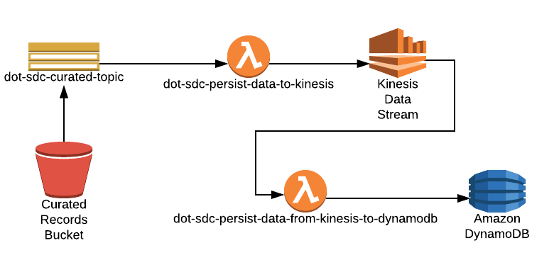

# sdc-dot-persist-data-to-kinesis
This lambda function is developed by SDC Team for persisting the curated data to Kinesis Data Stream.

There are two primary functions that this lambda function serves:
* **fetchS3DetailsFromEvent** - gets the S3 key from the event which is further used to get the metadata using S3 head object API.
* **sendDatatoKinesis** - Pushes curated data in the Kinesis data stream.

<a name="toc"/>

## Table of Contents

[I. Release Notes](#release-notes)

[II. Overview](#overview)

[III. Design Diagram](#design-diagram)

[IV. Getting Started](#getting-started)

[V. Unit Tests](#unit-tests)

[VI. Support](#support)

---

<a name="release-notes"/>


## [I. Release Notes](ReleaseNotes.md)
TO BE UPDATED

<a name="overview"/>

## II. Overview
The primary function of this lambda function is:

**1.** Get the S3 key from the event sent by SNS topic.

**2.** Fetch the S3 object using the head object from the S3 key got from the event in point 1.

**3.** Pushes the curated record in the Kinesis Data Stream configured for this lambda function.

**4.** In case of any failures/errors it pushes the messages in DLQ so that these messages can be analysed/processed later.

<a name="design-diagram"/>

## III. Design Diagram



<a name="getting-started"/>

## IV. Getting Started

The following instructions describe the procedure to build and deploy the lambda.

### Prerequisites
* NA 

---
### ThirdParty library

*NA

### Licensed softwares

*NA

### Programming tool versions

*Python 3.6


---
### Build and Deploy the Lambda

#### Environment Variables
Below are the environment variable needed :- 

KINESIS_STREAM - {name_of_kinesis_data_stream_to_send_data_to}

LOG_LEVEL  - {log_level}

#### Build Process

**Step 1**: Setup virtual environment on your system by following below link
https://docs.aws.amazon.com/lambda/latest/dg/with-s3-example-deployment-pkg.html#with-s3-example-deployment-pkg-python

**Step 2**: Create a script with below contents e.g(sdc-dot-persist-data-to-kinesis.sh)
```#!/bin/sh

cd sdc-dot-persist-data-to-kinesis
zipFileName="sdc-dot-persist-data-to-kinesis.zip"

zip -r9 $zipFileName common/*
zip -r9 $zipFileName kinesis_data_persist_handler/*
zip -r9 $zipFileName README.md
zip -r9 $zipFileName bucket_event_handler_main.py
```

**Step 3**: Change the permission of the script file

```
chmod u+x sdc-dot-persist-data-to-kinesis.sh
```

**Step 4** Run the script file
./sdc-dot-persist-data-to-kinesis.sh

**Step 5**: Upload the sdc-dot-persist-data-to-kinesis.zip generated from Step 4 to a lambda function via aws console.

[Back to top](#toc)

---
<a name="unit-tests"/>

## V. Unit Tests

TO BE UPDATED

---
<a name="support"/>

## VI. Support

For any queries you can reach to support@securedatacommons.com
---
[Back to top](#toc)